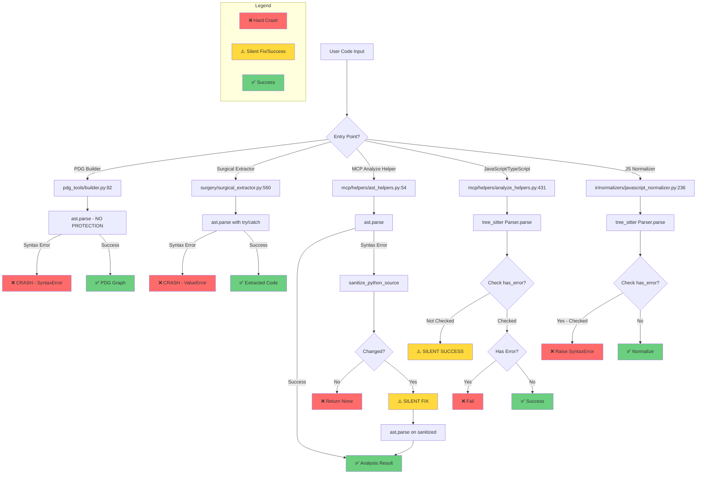
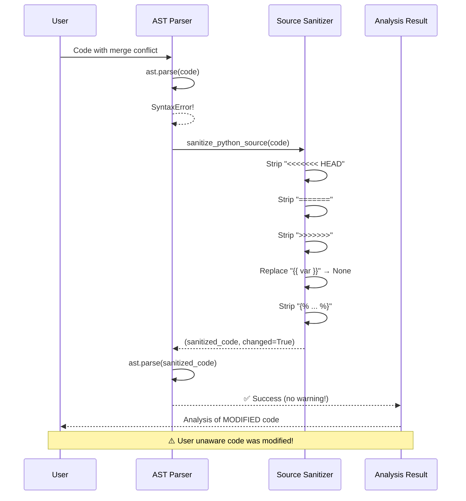
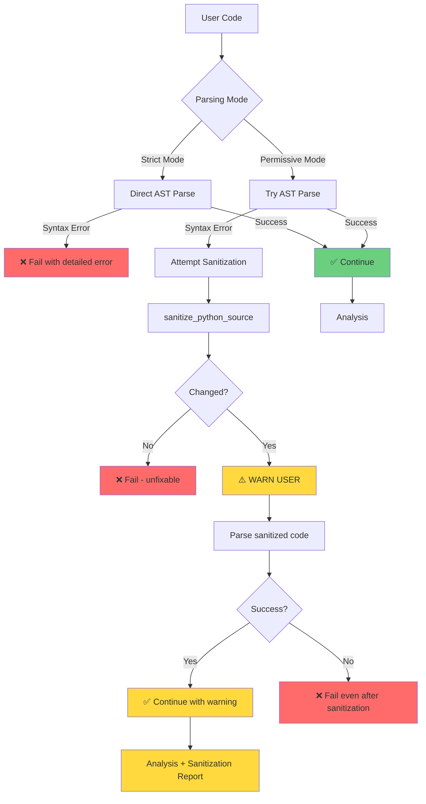

# AST Parsing Architecture: Error Handling Flow



## Code Path Comparison Matrix

| Entry Point | File | Line | Sanitization | Error Check | Failure Mode |
|-------------|------|------|--------------|-------------|--------------|
| **PDG Builder** | `pdg_tools/builder.py` | 82 | ❌ NO | ❌ NO | **CRASH** |
| **Surgical Extractor** | `surgery/surgical_extractor.py` | 560 | ❌ NO | ✅ try/catch | **CRASH (ValueError)** |
| **MCP AST Helper** | `mcp/helpers/ast_helpers.py` | 54 | ✅ YES | ✅ try/catch | **SILENT FIX** |
| **MCP Analyze (Python)** | `mcp/helpers/analyze_helpers.py` | - | ✅ Via AST Helper | ✅ YES | **SILENT FIX** |
| **MCP Analyze (JS/TS)** | `mcp/helpers/analyze_helpers.py` | 431 | ⚠️ Tree-sitter | ❌ NO | **SILENT SUCCESS** |
| **JS Normalizer** | `ir/normalizers/javascript_normalizer.py` | 236 | ⚠️ Tree-sitter | ✅ YES | **PROPER FAIL** |

## Sanitization Flow



## Tree-Sitter Error Recovery

```mermaid
graph LR
    A[JavaScript Code] --> B[Tree-Sitter Parse]
    B --> C{Has ERROR nodes?}
    C -->|Missing Semicolon| D[ERROR: Expected ';']
    C -->|Missing Brace| E[ERROR: Expected '}']
    C -->|Merge Conflict| F[ERROR: Unexpected token]
    
    D --> G[⚠️ But parse succeeds!]
    E --> G
    F --> G
    
    G --> H{Analyzer checks has_error?}
    H -->|NO Check| I[⚠️ Reports success=True]
    H -->|Checks| J[❌ Reports error]
    
    style I fill:#ffd93d
    style J fill:#ff6b6b
    style G fill:#ffd93d
```

## Recommended Architecture



## Key Recommendations

### 1. Add Configuration Flag

```python
from dataclasses import dataclass

@dataclass
class ParsingConfig:
    strict_mode: bool = True
    allow_templates: bool = False
    allow_merge_conflicts: bool = False
    warn_on_sanitization: bool = True
    tree_sitter_check_errors: bool = True
```

### 2. Standardize Entry Points

All parsers should use the same config:

```python
def parse_python_code(
    code: str,
    *,
    config: ParsingConfig | None = None
) -> tuple[ast.AST, list[str]]:
    """
    Parse Python code with configurable error handling.
    
    Returns:
        (ast_tree, warnings_list)
    """
    config = config or get_default_config()
    warnings = []
    
    if config.strict_mode:
        return ast.parse(code), warnings
    
    try:
        return ast.parse(code), warnings
    except SyntaxError:
        sanitized, changed = sanitize_python_source(code)
        if not changed:
            raise
        
        if config.warn_on_sanitization:
            warnings.append(
                "Code was sanitized: removed merge conflicts and templates"
            )
        
        return ast.parse(sanitized), warnings
```

### 3. Add Tree-Sitter Error Detection

```python
def parse_javascript_code(
    code: str,
    *,
    is_typescript: bool = False,
    config: ParsingConfig | None = None
) -> tuple[Tree, list[str]]:
    config = config or get_default_config()
    warnings = []
    
    # Parse
    parser = get_js_parser(is_typescript)
    tree = parser.parse(bytes(code, "utf-8"))
    
    # Check for errors
    if config.tree_sitter_check_errors and tree.root_node.has_error:
        error_node = find_first_error_node(tree.root_node)
        loc = f"line {error_node.start_point[0]+1}"
        raise SyntaxError(f"JavaScript parse error at {loc}")
    
    return tree, warnings
```

### 4. Return Sanitization Report

```python
@dataclass
class AnalysisResult:
    success: bool
    functions: list[str]
    classes: list[str]
    warnings: list[str]  # ✅ Add this!
    code_was_modified: bool  # ✅ Add this!
    sanitization_changes: list[str] | None  # ✅ Add this!
```

Example usage:
```python
result = analyze_code(dirty_code)
if result.code_was_modified:
    print("⚠️ Warning: Code was sanitized before analysis!")
    print("Changes:", result.sanitization_changes)
    # ['Removed merge conflict markers on lines 3-5',
    #  'Replaced Jinja2 expression on line 7']
```

---

**Architecture Review Summary**:

Current state:
- 🔴 **Inconsistent** - Different code paths, different behaviors
- 🟡 **Partially robust** - Some paths handle errors well
- 🔴 **Silent modifications** - User unaware of changes
- 🟢 **Good engineering** - Sanitization helpers exist

Recommended state:
- 🟢 **Consistent** - All paths use same config
- 🟢 **Transparent** - Always notify on modifications
- 🟢 **Configurable** - User controls strict vs. permissive
- 🟢 **Well-documented** - Clear behavior expectations
